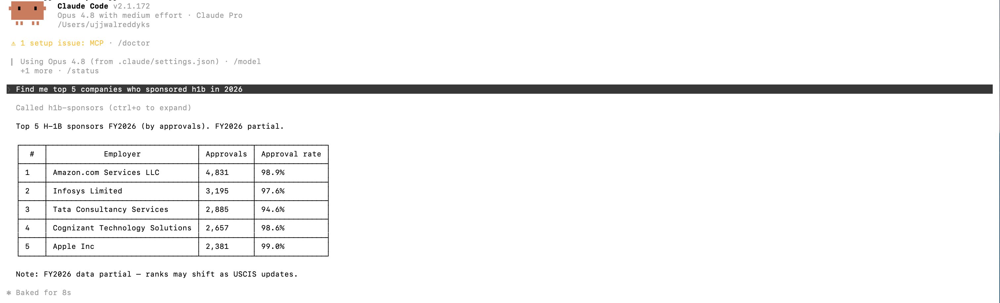

# H1B Sponsor MCP

Read-only MCP server for querying H-1B sponsoring employers from the USCIS
Employer Information dataset.

Repository: https://github.com/ujjwalredd/H1B-Sponsor-MCP.git



This server lets MCP clients answer questions like:

- "Does Stripe appear in the H-1B employer data?"
- "Which companies had the most H-1B approvals in Texas in FY2024?"
- "How did manufacturing sponsorship change from FY2009 to FY2026?"

The bundled cleaned dataset covers **fiscal years 2009-2026** with
**1,055,650 employer-year/location records** and **392,843 distinct employer
name strings**. FY2026 is a partial year.

## What It Provides

| Tool | Purpose |
| --- | --- |
| `search_employers` | Find employers by partial name, with lifetime totals |
| `employer_profile` | Get year-by-year approvals, denials, locations, and sectors for matching employers |
| `top_sponsors` | Rank sponsors by approvals, denials, petitions, approval rate, new employment approvals, or continuation approvals |
| `yearly_trends` | Return per-year totals from FY2009-FY2026, optionally filtered by state or NAICS sector |
| `industry_breakdown` | Summarize sponsorship by NAICS sector |
| `state_breakdown` | Summarize sponsorship by US state or territory |
| `dataset_info` | Return dataset coverage, row counts, and caveats |

## Quick Start

[`uvx`](https://docs.astral.sh/uv/) can fetch and run the server directly from
GitHub:

```bash
uvx --from git+https://github.com/ujjwalredd/H1B-Sponsor-MCP.git h1b-sponsor-mcp
```

After the package is published to PyPI, this shorter form should also work:

```bash
uvx h1b-sponsor-mcp
```

Install `uv` if needed:

```bash
curl -LsSf https://astral.sh/uv/install.sh | sh
```

## Claude Code

```bash
claude mcp add h1b-sponsors -- uvx --from git+https://github.com/ujjwalredd/H1B-Sponsor-MCP.git h1b-sponsor-mcp
```

## Claude Desktop

Add this server to `claude_desktop_config.json`:

```json
{
  "mcpServers": {
    "h1b-sponsors": {
      "command": "uvx",
      "args": [
        "--from",
        "git+https://github.com/ujjwalredd/H1B-Sponsor-MCP.git",
        "h1b-sponsor-mcp"
      ]
    }
  }
}
```

## Manual Install

```bash
git clone https://github.com/ujjwalredd/H1B-Sponsor-MCP.git
cd H1B-Sponsor-MCP
python -m pip install -e .
h1b-sponsor-mcp
```

The cleaned parquet is included in the package. To use a different cleaned
dataset file:

```bash
export H1B_DATA_PATH=/path/to/h1b_employers_clean.parquet
```

`H1B_DATA_PATH` must point to a `.parquet` file.

## Data

- Source: USCIS H-1B Employer Data Hub, Employer Information exports.
- Coverage: fiscal years 2009-2026.
- Packaged file: `src/h1b_mcp/data/h1b_employers_clean.parquet`.
- Details: see [DATA.md](DATA.md).

Recommended source citation:

> U.S. Citizenship and Immigration Services (USCIS). H-1B Employer Data Hub,
> Employer Information exports.
> https://www.uscis.gov/tools/reports-and-studies/h-1b-employer-data-hub

This project is independent and is not affiliated with, sponsored by, or
endorsed by USCIS, DHS, or the U.S. Government. The source data comes from a
U.S. federal government publication; U.S. Government works are generally not
copyright-protected in the United States under
[17 U.S.C. Section 105](https://www.law.cornell.edu/uscode/text/17/105). This is a
practical attribution note, not legal advice.

Important caveats:

- FY2026 is partial.
- Counts are petitions, not unique workers.
- Employer names are not entity-resolved; the same company may appear under
  multiple spellings or legal names.
- `approval_rate` is `approvals / (approvals + denials)`.
- This project is an information tool, not legal or immigration advice.

## Security Model

This server is intentionally narrow:

- stdio transport by default; no network listener is opened by this package.
- Read-only data access; no mutating MCP tools.
- No SQL, `eval`, `exec`, pickle loading, or shell execution.
- User search text is escaped before regex matching.
- Years, states, NAICS sectors, sort metrics, and limits are validated before
  the data layer runs.
- Results are hard-capped to protect client context windows.
- Errors returned to clients are sanitized; stack traces stay in stderr logs.

See [SECURITY.md](SECURITY.md) for the full policy and vulnerability reporting
instructions.

## Development

```bash
python -m pip install -e ".[dev]"
pytest
ruff check src tests
```

For quick local test runs without installing the editable package:

```bash
PYTHONPATH=src pytest
```

Run the MCP inspector:

```bash
mcp dev src/h1b_mcp/server.py
```

## Open Source

- Contributions: [CONTRIBUTING.md](CONTRIBUTING.md)
- Code of conduct: [CODE_OF_CONDUCT.md](CODE_OF_CONDUCT.md)
- Support: [SUPPORT.md](SUPPORT.md)
- Security: [SECURITY.md](SECURITY.md)
- Notice and attribution: [NOTICE.md](NOTICE.md)
- License: [MIT](LICENSE)

The source code is MIT licensed. Retain USCIS attribution when redistributing
the packaged or derived data files.
